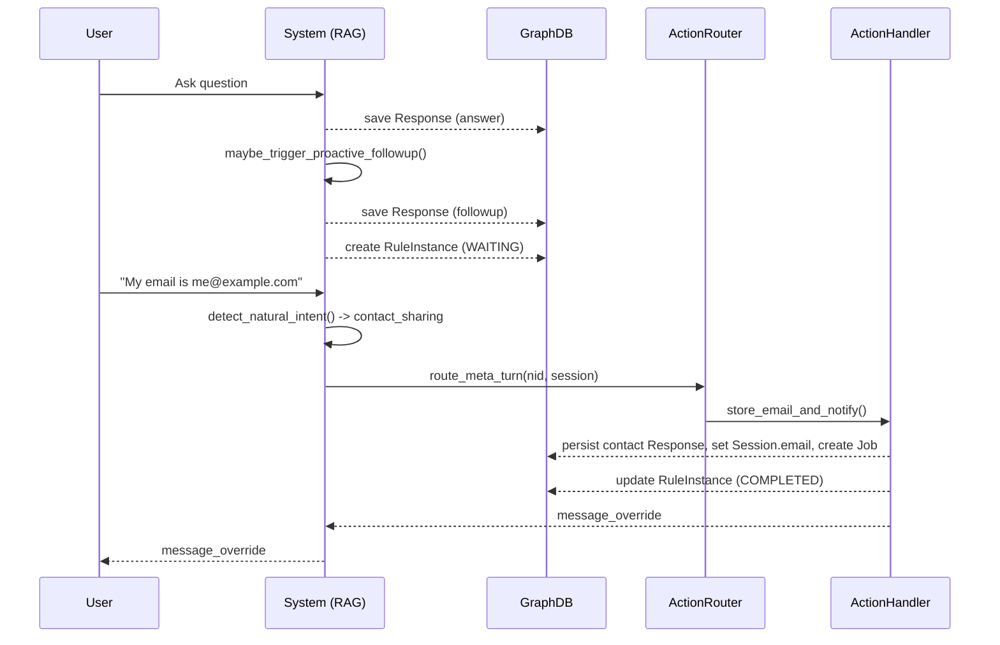

Backend README
===============

This README covers local developer guidance for the backend, testing, and the proactive action components (RuleInstance, Action Router, meta-turn handling).

Running tests locally
---------------------

From the project root you can run the backend test suite like this (PowerShell):

```powershell
cd backend
pytest -q
```

You do not need to set PYTHONPATH manually; `tests/conftest.py` inserts the `backend/` directory onto `sys.path` when pytest runs.

Why `pytest.ini` and `conftest.py` exist
--------------------------------------
- `pytest.ini`: basic pytest configuration (test discovery & options).
- `tests/conftest.py`: test-time setup. It ensures the `backend/` directory is on `sys.path`, and exposes fixtures like `fake_graph` used by unit tests.

FakeGraph test utility
----------------------
- Location: `backend/test_utils/fake_graph.py`
- Purpose: a lightweight in-memory implementation of the small subset of Neo4j operations the tests perform.
- Supported operations:
  - store/read/clear `Session.pending_contact`
  - persist `Response` nodes (via `save_history_graph` interactions)
  - create / list / update `RuleInstance` nodes
  - attach `Session.email`
  - create a `Job` stub node
- Tests should use the `fake_graph` pytest fixture (provided in `tests/conftest.py`) which returns a fresh FakeGraph per test.

Environment variables
---------------------
- ENABLE_PROACTIVE_ACTIONS: when set to `true`/`1`/`yes` the Action Layer handlers (e.g., storing emails, creating Job stubs) are enabled. Tests set this during execution where necessary.

Proactive components: RuleInstance, Action Router, and meta-turn handling
-------------------------------------------------------------------------

1) RuleInstance

- Purpose: represent a pending admin-driven follow-up that expects a user meta-turn. Typical lifecycle:
  - CREATED / WAITING (after a proactive follow-up was emitted and persisted)
  - PENDING (optional intermediate state)
  - COMPLETED (when the required action has been executed)

- Storage: a `RuleInstance` node is persisted in the graph and linked to the `Session`.

Key helpers: `src/rule_instance.py`

2) Action Router

- Purpose: when the NID (Natural Intent Detector) marks a user message as a meta-turn (contact sharing, affirmative, etc.), the Action Router finds active RuleInstance(s) for the session and maps `(rule_id, nid.intent)` to the correct action handler.

- Example mapping: `ask_email_if_missing` + `contact_sharing(email)` -> `store_email_and_notify`

Key file: `src/proactive_action_router.py`

3) Action Layer

- Action handlers implement side-effects required by admin rules (persisting contact, creating a Job stub, updating the Session node, and marking RuleInstance COMPLETED).

- They are gated by `ENABLE_PROACTIVE_ACTIONS` for safe rollout/testing.

Key file: `src/proactive_actions.py`

4) Meta-turn flow (high-level)

- NID (rule-based, with LLM fallback) runs early in the chat handling path.
- If the NID indicates a meta-intent that does NOT require retrieval (e.g., contact_sharing or affirmative), the QA pipeline routes the turn to the Action Router before returning a canned reply.
- The router executes the mapped action handler, which may persist a contact, update RuleInstance status, create a Job stub, and return a `message_override` that the pipeline uses instead of the canned reply.

Examples and diagrams
---------------------

1) NID output example (JSON)

```json
{
  "intent": "contact_sharing",
  "confidence": 0.95,
  "slots": { "email": "user@example.com" },
  "requires_retrieval": false,
  "handler_name": "handle_contact_sharing"
}
```

2) Meta-turn flow (sequence)

User initiates chat -> System answers (RAG) -> Composer emits follow-up (persisted as Response:type=followup) -> RuleInstance created (WAITING)
User replies with meta-turn (e.g., shares email) -> NID detects meta-intent -> QA pipeline calls Action Router -> Action handler persists contact, creates Job stub, updates RuleInstance to COMPLETED -> Pipeline returns message_override to user.

3) Mermaid sequence diagram



4) RuleInstance lifecycle (example state transitions)

- CREATED (when follow-up persisted)
- WAITING (session waits for user meta-turn)
- PENDING (optional intermediate state)
- COMPLETED (action executed successfully)

Tips & examples
---------------
- To run a single test file quickly:

```powershell
cd backend
pytest tests/test_action_router_and_flow.py -q
```

+- To enable the Action Layer in a local run, set the env var before running tests or starting the app:

```powershell
$env:ENABLE_PROACTIVE_ACTIONS = "true"
pytest -q
```


CI (GitHub Actions)
---------------------
- Workflow: `.github/workflows/ci.yml` runs tests on push and PRs. It installs dependencies from `requirements.txt`, runs pytest, and uploads test artifacts.

Questions or next steps
-----------------------
- Want CI to run coverage and test a Python matrix (3.9/3.10/3.11)? I can add coverage reporting and expand the workflow.
- Should we extract FakeGraph into a small test package (e.g., `tests/utils`) with more realistic behavior (temporal types, elementId matching)? I can do that next.

Contact
-------
For questions about the proactive design or to propose additional admin rule mappings, open an issue or ping the team.
