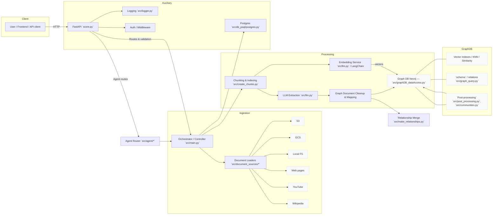

# Architecture Diagram Mermaid

Below is a Mermaid diagram representing the high-level architecture of the `llm-graph-builder` backend. Save or render with any Mermaid-capable renderer.

```mermaid
flowchart LR
  subgraph Client
    A[User / Frontend / API client]
  end

  A -->|HTTP| B[FastAPI `score.py`]
  B -->|Routes & validation| ORCH[Orchestrator / Controller `src/main.py`]
  B -->|Agent routes| AGENT[Agent Router `src/agent/*`]

  subgraph Ingestion
    ORCH --> DL[Document Loaders `src/document_sources/*`]
    DL --> S3[S3]
    DL --> GCS[GCS]
    DL --> Local[Local FS]
    DL --> Web[Web pages]
    DL --> YouTube[YouTube]
    DL --> Wikipedia[Wikipedia]
  end

  subgraph Processing
    ORCH --> CHUNKS[Chunking & Indexing `src/create_chunks.py`]
    CHUNKS --> EMB[Embedding Service `src/llm.py` / LangChain]
    CHUNKS --> LLM[LLM Extraction `src/llm.py`]
    LLM --> CLEAN[Graph Document Cleanup & Mapping]
    CLEAN --> GDB[Graph DB Neo4j — `src/graphDB_dataAccess.py`]
    EMB -->|vectors| GDB
  end

  subgraph GraphDB
    GDB --- VECTOR[Vector Indexes / KNN / Similarity]
    GDB --- SCHEMA[`schema` / relations `src/graph_query.py`]
    GDB --- POSTP[`Post-processing` `src/post_processing.py`, `src/communities.py`]
  end

  subgraph Auxiliary
    ORCH --> PSQL[Postgres `src/db_psql/postgres.py`]
    B --> LOG[Logging `src/logger.py`]
    B --> AUTH[Auth / Middleware]
  end

  AGENT --> ORCH
  CLEAN --> MAKE_REL[`Relationship Merge `src/make_relationships.py`]
  POSTP --> GDB

  %% Notes
  classDef infra fill:#f8f9fa,stroke:#ddd;
  class S3,GCS,Local,Web,YouTube,Wikipedia infra
  class GDB,VECTOR,SCHEMA,POSTP infra
```
