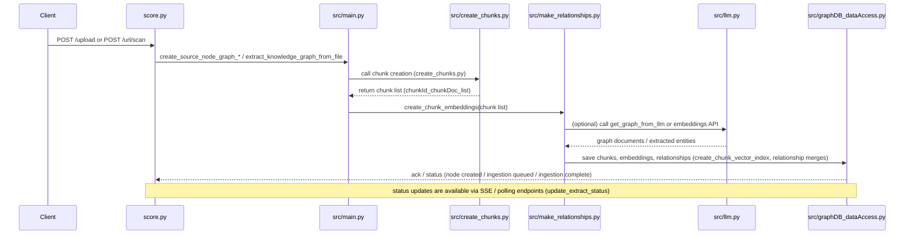

```markdown
# Ingestion sequence — upload → chunking → embedding → LLM → Neo4j

This sequence diagram shows the high-level call flow for ingesting a document (via upload or URL scan) through chunking, embedding, LLM extraction, and saving to Neo4j.



Mapping to files (quick):
- API endpoints: `score.py` (see create_source_knowledge_graph_url, extract_knowledge_graph_from_file, upload_large_file_into_chunks)
- Orchestration: `src/main.py` (processing_source, processing_chunks, upload_file/merge_chunks_local)
- Chunk creation: `src/create_chunks.py`
- Embeddings & relationships: `src/make_relationships.py` (create_chunk_embeddings, create_chunk_vector_index)
- LLM / extraction: `src/llm.py` (get_graph_from_llm and related helpers)
- Graph writes: `src/graphDB_dataAccess.py` (create_source_node and other persistence functions)

```
