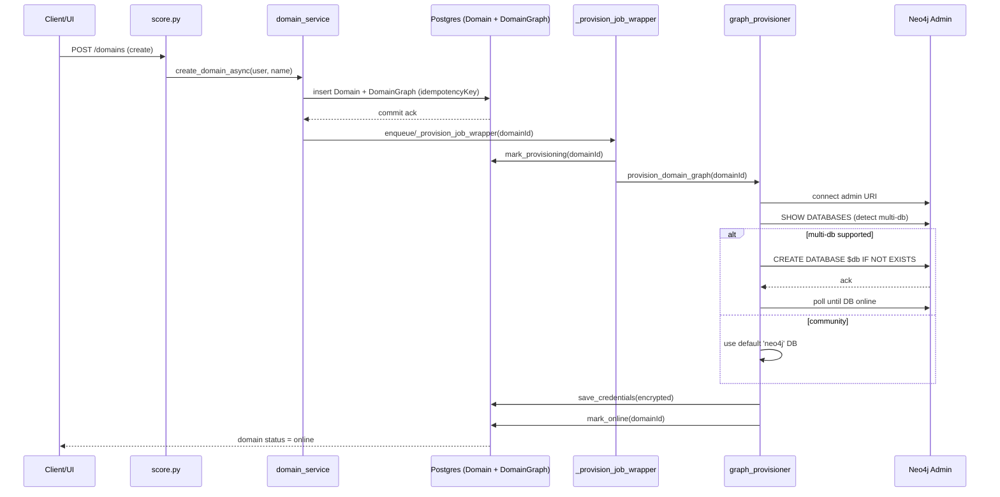

```markdown
# Provisioning flow — Postgres state transitions & Neo4j DB creation

This file contains two lightweight Mermaid diagrams: a flowchart that visualizes the Postgres DomainGraph state transitions and a sequence diagram that shows the operational handoff from API -> service -> worker -> Neo4j admin.

## Flowchart: Postgres DomainGraph state transitions

```mermaid
flowchart TD
  UI[Client / Admin UI]
  API[FastAPI - domain create endpoint]
  Service[domain_service.create_domain_async]
  PG_Insert[(Postgres) Domain row + DomainGraph]
  Commit[db.commit()]
  Worker[Background worker / _provision_job_wrapper]
  MarkProv[(DomainGraph.provisionStatus = provisioning)]
  Provisioner[graph_provisioner.provision_domain_graph]
  Neo4jAdmin[(Neo4j Admin API)]
  CreateDB[CREATE DATABASE (IF SUPPORTED)]
  WaitOnline[wait until DB online]
  SaveCreds[(save encrypted credentials -> DomainGraph.secret_enc)]
  MarkOnline[(DomainGraph.provisionStatus = online)]
  MarkFailed[(DomainGraph.provisionStatus = failed)]

  UI -->|create domain| API --> Service --> PG_Insert --> Commit
  Commit -->|enqueue or inline| Worker
  Worker --> MarkProv --> Provisioner --> Neo4jAdmin
  Neo4jAdmin --> CreateDB --> WaitOnline
  WaitOnline -->|success| SaveCreds --> MarkOnline
  WaitOnline -->|timeout/error| MarkFailed
  CreateDB -->|unsupported (Community)| Provisioner --> SaveCreds

  classDef pgState fill:#f9f,stroke:#333,stroke-width:1px;
  class MarkProv,MarkOnline,MarkFailed pgState;

```

## Sequence: operational handoff (compact)



## Quick mapping to code

- API endpoint: `score.py` -> domain creation endpoint (calls service layer)
- Service orchestration: `src/services/domain_service.py` -> `create_domain_async`, `_provision_job_wrapper`
- Postgres session + DI: `src/db_psql/postgres.py` -> `SessionLocal`, `get_db()`
- Provisioner: `src/services/graph_provisioner.py` -> `_admin_driver`, `_supports_multi_db`, `provision_domain_graph`, `_wait_until_online`, `save_credentials`

---
File created by the agent to visualize provisioning flow (append-only to docs). If you'd like, I can export these diagrams as PNG/SVG files or add a rendered image to the repo.

```
