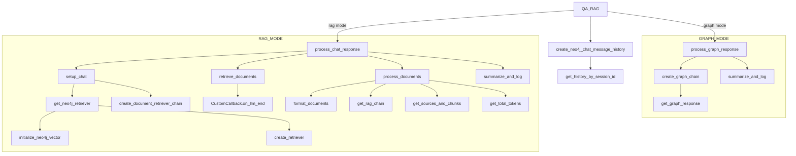

```mermaid
flowchart TD
  QA_RAG -->|graph mode| PGR[process_graph_response]
  QA_RAG -->|rag mode| PCR[process_chat_response]
  QA_RAG --> CNH[create_neo4j_chat_message_history]
  CNH --> GHBID[get_history_by_session_id]

  subgraph GRAPH_MODE
    PGR --> CGC[create_graph_chain]
    CGC --> GGR[get_graph_response]
    PGR --> SUM1[summarize_and_log]
  end

  subgraph RAG_MODE
    PCR --> SC[setup_chat]
    SC --> GNR[get_neo4j_retriever]
    GNR --> INV[initialize_neo4j_vector]
    GNR --> CRV[create_retriever]
    SC --> CDRC[create_document_retriever_chain]
    PCR --> RD[retrieve_documents]
    RD --> CB[CustomCallback.on_llm_end]
    PCR --> PD[process_documents]
    PD --> FD[format_documents]
    PD --> GRC[get_rag_chain]
    PD --> GSC[get_sources_and_chunks]
    PD --> GTT[get_total_tokens]
    PCR --> SUM2[summarize_and_log]
  end
```
